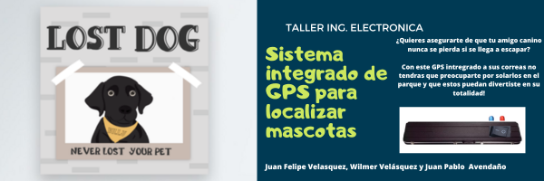
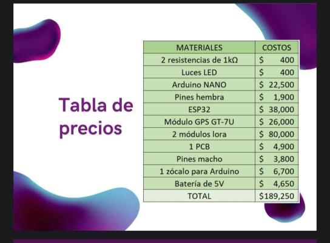
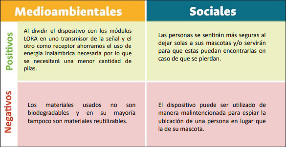
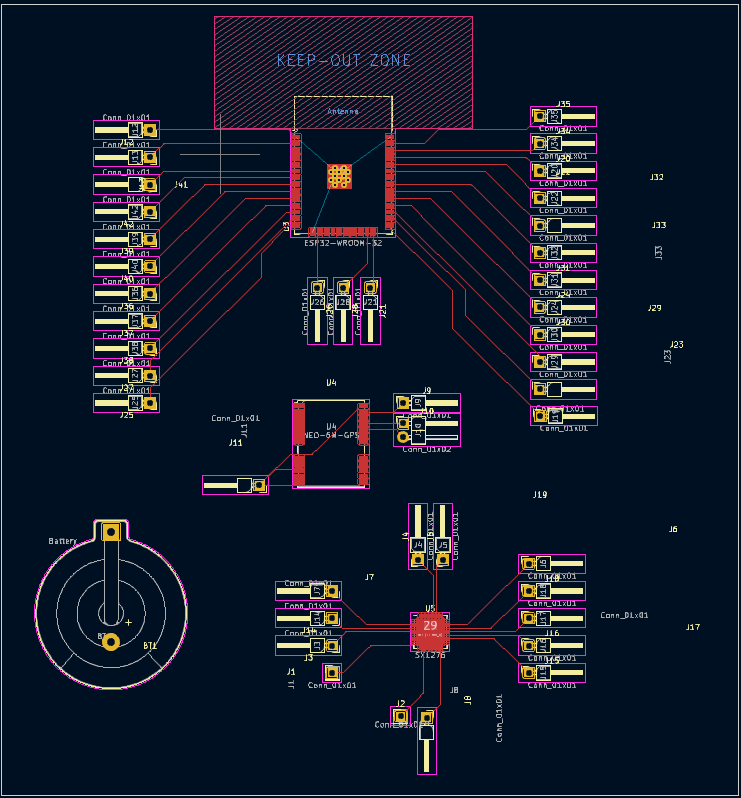
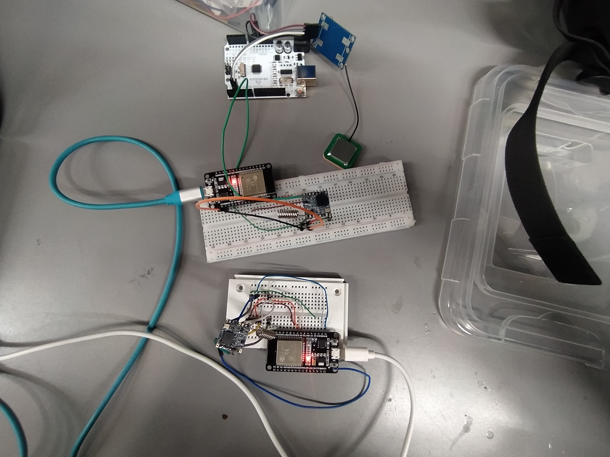

# Sistema Integrado de GPS para mascotas

Integrantes:

* Juan Felipe Velásquez Jaramillo - juvelasquezj@unal.edu.co
* Wilmer Daniel Velásquez Tumay - wvelasquezt@unal.edu.co
* Juan Pablo Avendaño Acero - javendanoa@unal.edu.co

## Banner del proyecto

## Resumen
El objetivo principal de este proyecto académico es diseñar un dispositivo portátil de localización para mascotas que pueda ser colocado en su correa. Esta iniciativa surge en respuesta a la creciente preocupación de los propietarios por la seguridad de sus mascotas. Aunque los dueños desean evitar que sus mascotas se pierdan, no siempre pueden vigilarlas constantemente debido a diversas circunstancias. En tales casos, los animales pueden ser confiados a terceros o incluso quedarse solos por un tiempo determinado. Para abordar esta problemática, el proyecto propone el uso de una página web que permita a los dueños conocer la ubicación precisa y en tiempo real de sus mascotas. Esto se logrará mediante el desarrollo de un sistema de rastreo basado en GPS, utilizando módulos LORA para garantizar una amplia y eficiente cobertura. El dispositivo de localización diseñado permitirá a los propietarios supervisar la ubicación de sus mascotas en todo momento, brindando una mayor tranquilidad y seguridad. Además, la tecnología GPS y los módulos LORA ofrecerán una precisión óptima, asegurando que los dueños puedan localizar a sus mascotas incluso en áreas extensas. En conclusión, este proyecto académico busca desarrollar un dispositivo portátil de localización para mascotas que se integre con una página web, brindando a los propietarios la capacidad de conocer la ubicación exacta de sus animales en tiempo real. El uso de módulos LORA y la tecnología GPS garantizarán un rastreo preciso y una cobertura amplia, proporcionando a los dueños mayor tranquilidad y confianza en la seguridad de sus mascotas.

## Problematica
El motivo de la creación de este proyecto es que actualmente la seguridad se ha convertido en un factor de interés general entre los dueños de mascotas cuando se trata de que estas no se pierdan, sin embargo, por varios motivos los dueños no pueden estar todo el tiempo al pendiente de sus mascotas por lo que los dejan al cuidado de terceros o inclusive los dejan solos si así lo ameritan las circunstancias, por ello, este proyecto plantea que mediante una página web los padres puedan conocer en tiempo real y con alta precisión la ubicación de sus mascotas.

## Alcance
El proyecto define su alcance en esta primera etapa con la intercomunicación de los modulos lora y la integración del gps a los mismos

## Costos

## Objetivos

* Objetivo Principal
  
        Diseñar un dispositivo portátil de localización para mascotas que se pueda colocar en su correa.

* Objetivos Secundarios:

     1. Desarrollar un sistema de rastreo basado en GPS que permita conocer la ubicación precisa y en tiempo real de las mascotas.
     2.  Utilizar módulos LORA para garantizar una amplia y eficiente cobertura en el rastreo de las mascotas.
     3. Integrar el dispositivo de localización con una página web o mensaje de texto que brinde a los propietarios la capacidad de supervisar la ubicación exacta de sus mascotas en todo momento.
   
## Impactos

## Diagrama de flujo solución

## Diagrama de caja negra (no tecnologico)

## Diagrama de caja negra tecnológico

## Imagen proceso trabajo en tablero

## Esquematico pcb

## Pruebas/Imágenes
1. Imágen referencia para el proyecto.

2. Versión alternativa con modulo gms.

3. Versión preliminar.

## Conclusiones
* La utilización de módulos LORA aumenta el rango de
efectividad del GPS.
* La utilización de un GPS para las mascotas genera
mayor seguridad a los dueños de los mismos.
* La conección entre modulos lora se facilita al tener microprocesadores iguales en ambos sistemas.

## Video del proyecto
[Video proyecto]()

## Referencias
[Enlace Referencias]([www.unal.edu.co](https://docs.google.com/document/d/1pl94NhDiLS5le3mnF0FaL84PyjT1eD7dEBsACEJOMd0/edit?usp=sharing))

